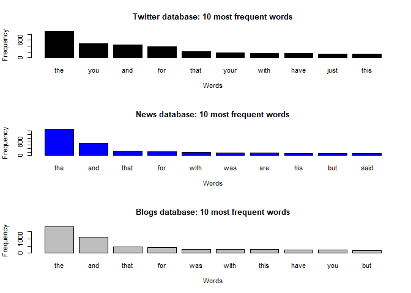
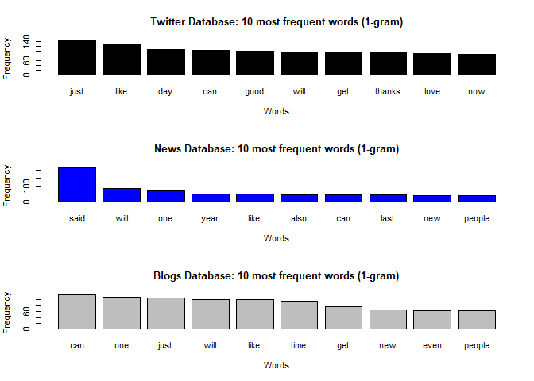
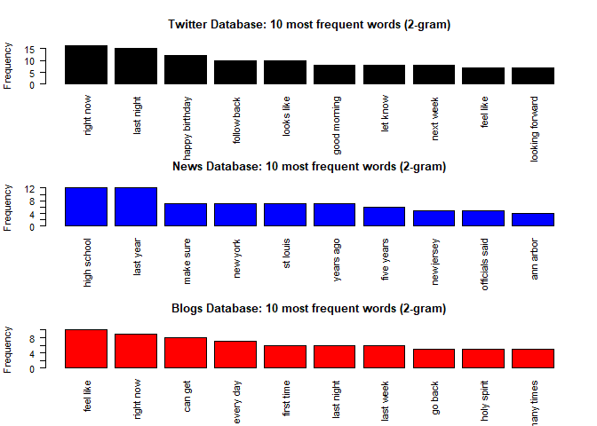
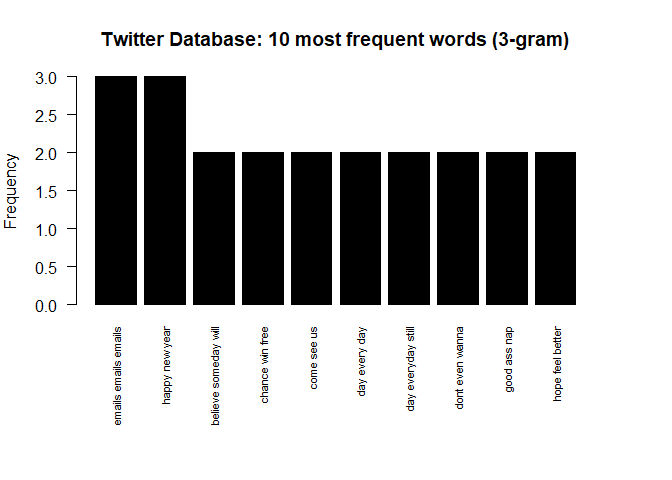
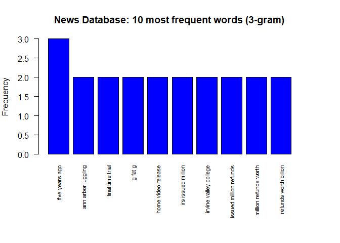
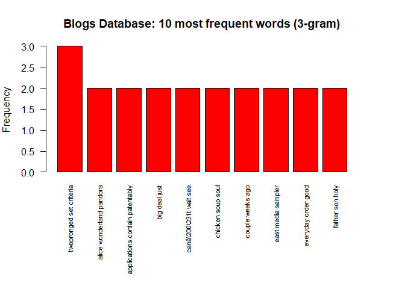

## Executive summary

In this document I report the exploratory analysis of the training data provided for the Data Science Capstone course, which comes from a corpus called HC Corpora and were collected from publicly available sources by a web crawler. 

As the assignment indicates, this document will explain only the major features of the mentioned data set. At the end, I briefly summarize my plans for creating the prediction algorithm in a Shiny application.

The codes in R that I created to perform this analysis can be accessed from my GitHub repository <https://github.com/KarlMC83/DataScienceCapstone_MilestoneReport>. 

## 1.Exploratory analysis

As was indicated in the section *"Task 1 - Getting and cleaning the data"*, I will explore the **English database** of the training data, which has three files with text extracted from Twitter, News and Blogs sources.

These databases are large as it is shown in the tables below, in which it is reported the basic characteristics of each database such as the size, number of lines and number of words (e.g. the bigger one has more than 2.3 million of lines and more than 30 million of words). Therefore, in order to extract the main features in an efficient manner, I selected randomly a sample of lines from each database by using a binomial process, procedure that guarantees that the sample is representative of the original. The size of these samples are 0.1%, 1% and 0.1%, respectively; the second sample has a bigger percentage due to the relatively smaller size of the original database.  


**Twitter Database**

```
## [1] "Original File size: 319 Mb   Lines in Original File: 2360148   Words in Original File: 30218125"
```

```
## [1] "Sample File size: 0.3 Mb   Lines in Sample File: 2368   Words in Sample File: 29837"
```

**News Database**

```
## [1] "Original File size: 19.8 Mb   Lines in Original File: 77259   Words in Original File: 2693898"
```

```
## [1] "Sample File size: 0.2 Mb   Lines in Sample File: 801   Words in Sample File: 27879"
```

**Blogs Database**

```
## [1] "Original File size: 255.4 Mb   Lines in Original File: 899288   Words in Original File: 38154238"
```

```
## [1] "Sample File size: 0.3 Mb   Lines in Sample File: 886   Words in Sample file: 38433"
```

### 1.1. The importance of pre-processing

In this section I show the importance of pre-processing the databases. In the graph below, it is reported the 10 most frequent words in each database, and we can see that they share similar words. In fact, the most used word is **"the"**, followed by **"and"**, words that don't provide important information given that they are common articles and conjunctions used in any language. For this reason, the three databases were pre-processed in order to remove these type of words, punctuation, numbers and other special characters. The results are shown in the next sections. 





### 1.2. 1-gram analysis

In this section I report features of the three databases (after pre-processing) by analyzing the ten most frequent words in each one. This type of analysis is also known as *n-gram* analysis, in which a continuous sequence of *n* words from a given sample of text is extracted and evaluated. In this case, *n* is equal to 1, which is also referred to as *unigram*.

As it is shown below, **"just"** is the most used word in the Twitter sample, followed by **"like"** and **"day"**. In the News sample, **"said"** is the most frequent word, followed by **"will"** and **"one"**. While in the Blogs sample, **"can"** is the most frequent word, followed by **"one"** and **"just"**. Another feature is that the three databases share common words such as **"will"** and **"can"**, but samples from  Twitter and Blogs share even more common words which could be explained by the fact that they are written in an *informal* form, while News uses a *formal* writing. 



On the other hand, in the table below I show words that are more associated with the most frequent word in each database, and the corresponding correlation is also reported. We can extract two features from this table, about the number of associated words and their correlation. In the Twitter sample, the most frequent word has fewer associated words and smaller correlations. In the News sample, the most frequent word has more associated words and higher correlations. And in the Blogs sample, the most frequent word has the largest number of associated words and highest correlations. 

These features could be associated with the form in which each type of text is written, which could be an important component in creating a prediction algorithm. It remains to see if these features also hold for the rest of frequent words in each database.  

**Twitter sample: associations and their correlation with the most frequent word "just"**

```
## $just
##    parts   bagels      flu softball  beibers  bladder     gall 
##     0.17     0.16     0.16     0.16     0.16     0.16     0.16
```

**News sample: associations and their correlation with the most frequent word "said"**

```
## $said
##       signs     collova  entrapment   expanding      marked      permit 
##        0.22        0.19        0.19        0.19        0.19        0.19 
## recommended        zone       zones 
##        0.19        0.19        0.19
```

**Blogs sample: associations and their correlation with the most frequent word "can"**

```
## $can
##        aid  endurance  enhancing  implement  improving increasing     senses 
##       0.43       0.43       0.43       0.43       0.43       0.43       0.43 
##    sharpen  sprinting   stronger    thrower 
##       0.43       0.43       0.43       0.43
```

### 1.3. 2-gram analysis

In this section I report the *2-gram* analysis, which consists of extracting a continuous sequence of *2* words from the three databases given. This is also referred to as *bigram* analysis.

As we can see in the next graph, **"right now"**, **"high school"**, **"feel like"** are the most frequent phrases used in the Twitter, News and Blogs databases, respectively. On the other hand, Twitter and Blogs databases share again common phrases, such as **"right now"**, **"feel like"**, **"last night"** among others; while there are no common phrases shared with the News database. As in the *1-gram* analysis, this feature could be explained by the *formal* or *informal* writing use in each database. 

Thus, "2-gram" phrases could be also an important component in creating a prediction algorithm.




### 1.4. 3-gram analysis

In this section I report the *3-gram* analysis, which consists of extracting a continuous sequence of *3* words from the three databases given. This is also referred to as *trigram* analysis.

In this case, there aren't any common phrases shared in the three databases, and the common phrases have small frequencies. This feature could indicate that when the phrase gets larger (e.g. more than 2 words), it becomes more specific to the type of source from which it was extracted. 

This feature suggests that "3-gram" phrases won't probably be a helpful component in creating a prediction algorithm.








## 2. Plan for creating a prediction algorithm

I consider that the following points and steps could be helpful in creating a prediction algorithm:

- The 1-gram analysis seems to provide valuable information about the main features of a text sample. The frequencies of the 10 most common words were relevant and also the association with other words, which could help in predicting words in an efficient manner. 
- Nevertheless, the prediction power of these words depends on the type of writing, being less powerful if it is written in Twitter and higher if it is written in News and much higher for Blogs.
- As a pending exercise, it would be important to calculate the percentage of words covered by the 100 most common words and also their association with other words, for each type of text source. This can give us an idea of the potential predicting power of our model.
- The 2-gram analysis seems to provide also valuable information, but in a lesser extent. Thus, this analysis should be used to complement and boost the predicting power of the 1-gram analysis.
- The 3-gram analysis didn't provide valuable information. This suggests that dimension of an *n-gram* analysis should be as a maximum 3 or 4.

The end.


